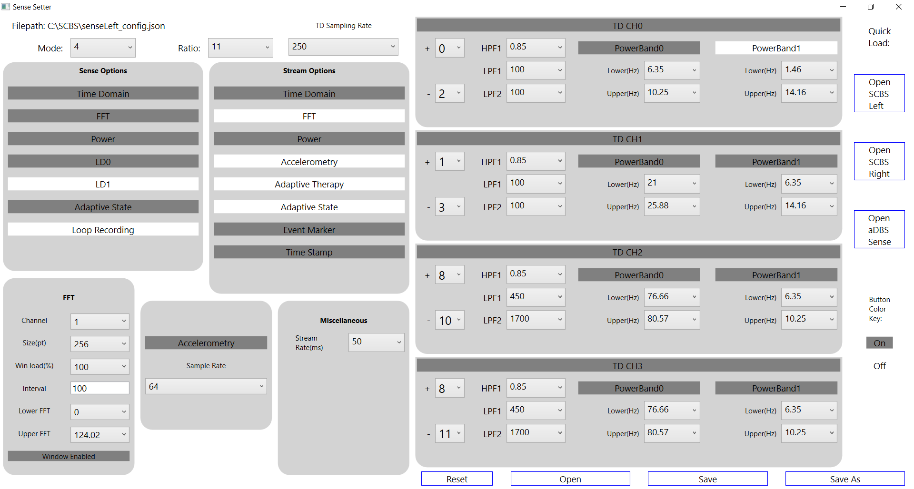
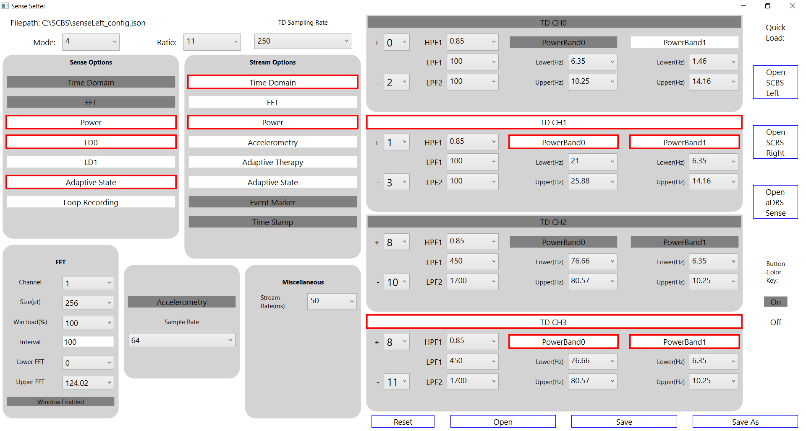

# UCSF-StarrLab-SenseSetter
GUI application that loads and saves sense settings for the RC+S

## Video Tutorial
[Setup and Walkthrough of Sense Setter](https://ucsf.box.com/s/nrxgdms322br15eg08hqsp2blk2grc5y)

## Overview



SenseSetter allows you to change the sense settings for the Medtronic RC+S. This will be saved to a .json format file that can be used to upload into your code for the sensing configuration. The .json file saves into this format: 
```
{
	"eventType": {
		"comment": "event name to use to log to .json files",
		"type": "Home streaming"
	},
	"Mode": 4,
	"Ratio": 10,
	"SenseOptions": {
		"comment": "lets you set what to sense",
		"TimeDomain": true,
		"FFT": true,
		"Power": true,
		"LD0": false,
		"LD1": false,
		"AdaptiveState": false,
		"LoopRecording": false,
		"Unused": false
	},
	"StreamEnables": {
		"comment": "lets you set what to stream",
		"TimeDomain": true,
		"FFT": false,
		"Power": false,
		"Accelerometry": false,
		"AdaptiveTherapy": false,
		"AdaptiveState": false,
		"EventMarker": false,
		"TimeStamp": false
	},
	"Sense": {
		"commentTDChannelDefinitions": "No more than two channels can be on a single bore. When configuring, channels on first bore will always be first. Can only have sampling rates of: 250, 500, and 1000 (Hz) or disable it by setting IsDisabled to true",
		"commentFilters": "Stage one low pass(Lpf1) can only be: 450, 100, or 50 (Hz). Stage two low pass(Lpf2) can only be: 1700, 350, 160, or 100 (Hz). High pass(Hpf) can only be: 0.85, 1.2, 3.3, or 8.6 (Hz), Inputs[ anode(positive), cathode(negative) ]",
		"TDSampleRate": 250,
		"TimeDomains": [
			{
				"IsEnabled": true,
				"Hpf": 0.85,
				"Lpf1": 100,
				"Lpf2": 100,
				"Inputs": [
					0,
					2
				]
			},
			{
				"IsEnabled": true,
				"Hpf": 0.85,
				"Lpf1": 100,
				"Lpf2": 100,
				"Inputs": [
					1,
					3
				]
			},
			{
				"IsEnabled": true,
				"Hpf": 0.85,
				"Lpf1": 450,
				"Lpf2": 1700,
				"Inputs": [
					8,
					10
				]
			},
			{
				"IsEnabled": true,
				"Hpf": 0.85,
				"Lpf1": 450,
				"Lpf2": 1700,
				"Inputs": [
					9,
					11
				]
			}
		],
		"FFT": {
			"commentFFTParameters": "FFT Size can be: 64, 256, or 1024 samples, Hanning window load can be: 25, 50, or 100 (%), channel is for the fft channel must be between 0-3 and time domain must be enabled for that channel",
			"Channel": 1,
			"FftSize": 256,
			"FftInterval": 500,
			"WindowLoad": 50,
			"StreamSizeBins": 0,
			"StreamOffsetBins": 0,
			"WindowEnabled": true
		},
		"commentPower": "each power band can be set from 0-250hz, 2 pos bands per channel. Ex: ChNPowerBandN:[lower, upper]",
		"PowerBands": [
			{
				"comment": "Channel: 0 PowerBand: 0",
				"ChannelPowerBand": [
					21.0,
					29.79
				],
				"IsEnabled": true
			},
			{
				"comment": "Channel: 0 PowerBand: 1",
				"ChannelPowerBand": [
					25.88,
					26.86
				],
				"IsEnabled": true
			},
			{
				"comment": "Channel: 1 PowerBand: 0",
				"ChannelPowerBand": [
					6.35,
					14.16
				],
				"IsEnabled": true
			},
			{
				"comment": "Channel: 1 PowerBand: 1",
				"ChannelPowerBand": [
					6.35,
					14.16
				],
				"IsEnabled": true
			},
			{
				"comment": "Channel: 2 PowerBand: 0",
				"ChannelPowerBand": [
					16.11,
					18.07
				],
				"IsEnabled": true
			},
			{
				"comment": "Channel: 2 PowerBand: 1",
				"ChannelPowerBand": [
					64.94,
					67.87
				],
				"IsEnabled": true
			},
			{
				"comment": "Channel: 3 PowerBand: 0",
				"ChannelPowerBand": [
					16.11,
					18.07
				],
				"IsEnabled": true
			},
			{
				"comment": "Channel: 3 PowerBand: 1",
				"ChannelPowerBand": [
					65.92,
					67.87
				],
				"IsEnabled": true
			}
		],
		"Accelerometer": {
			"commentAcc": "Can be 4,8,16,32,64Hz or set SampleRateDisabled to true for disabled",
			"SampleRateDisabled": false,
			"SampleRate": 64
		},
		"Misc": {
			"commentMiscParameters": "stream rate can be 30-100 by tens and is in ms; LoopRecordingTriggersState can be 0-8 or can be disabled by changing IsEnabled to false; Bridging can be 0 = None, 1 = Bridge 0-2 enabled, 2 = Bridge 1-3 enabled",
			"StreamingRate": 50,
			"LoopRecordingTriggersState": 0,
			"LoopRecordingTriggersIsEnabled": true,
			"LoopRecordingPostBufferTime": 53,
			"Bridging": 0
		}
	}
}
```
#### *Note: You will need to save this sense file somewhere in your local directory initially first. Then you can upload it into the SenseSetter and edit configurations. You can then save it back to the original file or to a file of your choice.

### Error Checking
- There are various checks to ensure you are adhering to medtronic guidelines such as not allowing power streaming if power sensing is off. This is shown in the image under the next section "Changes Made to Sense" showing the power streaming automatically turns off if the power sense is turned off. Some other areas include turning off a time domain channel which will automatically turn off the power bands for that time domain channel. Many more similar types of checks in program.
- There is also a check to make sure there will not be significant packet drops.

### Changes Made to Sense
When there are changes made to the sense settings, the box border will highlight red. This means that the change has not been saved to  a file yet. After saving to file, the box border will no highlight red anymore. If the save was unsuccessful, an error message will appear and the box will contiunue to highlight red. The image for changes looks like:

